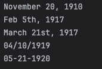

Data:

The Mexican Revolution, which occurred from 1910 to 1920, was a pivotal period in Mexican history.
It began on November 20, 1910, with an armed uprising against President Porfirio Díaz, who had held power for over three decades.
The promulgation of the Mexican Constitution on Feb 5th, 1917, introduced significant reforms, addressing issues such as land reform,
workers' rights, and the separation of church and state. March 21st, 1917, marked the presidency of Venustiano Carranza,
whose tenure focused on consolidating power and implementing reforms.
The assassination of Emiliano Zapata on 04/10/1919, deeply impacted the revolution, particularly the agrarian movement.
Finally, on 05-21-1920, Álvaro Obregón led a successful revolt against Carranza's government, resulting in his presidency.
These important dates highlight key moments in the Mexican Revolution's trajectory, shaping the course of Mexico's future.

Result:

